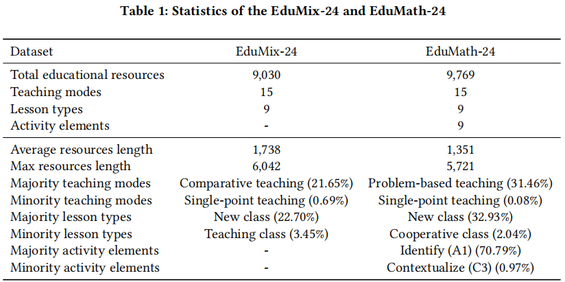
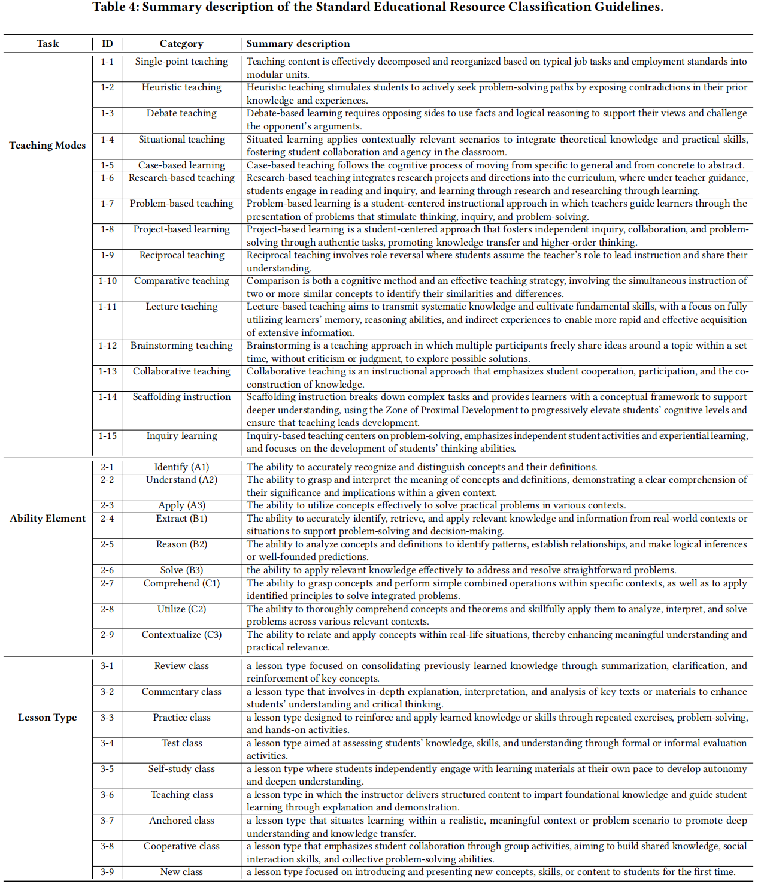
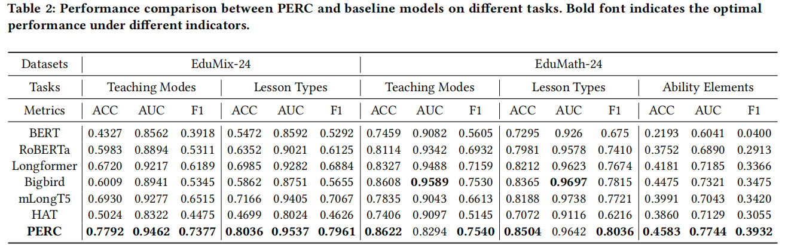

# <div align="center">📝EduMix-24 and EduMath-24 Datasets

<div align="center">
<p></p>

<b>PERC: A Prior-Guided Framework for Classifying Long-Content Educational Resources with Imbalanced Category Distributions</b> </a>

<b>The Conference on Information and Knowledge Management (CIKM) , 2025</b>

:star:Official release of the EduMix-24 and EduMath-24 Datasets.
</div>

## Directory

- [Usage & Download](#usage&download)
- [Description](#description)
- [Collection](#collection)
- [Responsible Use](#responsible-use)
- [Experimental Result](#experimental-result)
- [License](#license)
- [Copyright](#copyright)

## <div align="center" id="usage&download">🖥️Usage & Download</div> <!-- omit in toc -->

- The EduMix-24 and EduMath-24 Datasets can only be used for non-commercial research purposes. For scholar or organization who wants to use the EduMix-24 and EduMath-24 Datasets, please first fill in this [Application Form](./application-form/Application-Form-for-Using-EduMix-24 and EduMath-24 Datasets.docx) and sign the [Legal Commitment](./application-form/Legal-Commitment.docx) and email them to us. When submitting the application form to us, please list or attached 1-2 of your publications in the recent 6 years to indicate that you (or your team) do research in the related research fields of Smart Education,  Long-Content Classification, Imbalanced Categories, Prior Knowledge, Large Language Model, and so on. 
- We will give you the download link and the decompression password after your application has been received and approved.
- All users must follow all use conditions; otherwise, the authorization will be revoked.

## <div align="center" id="description">📖Description</div>

The EduMix-24 and EduMath-24 datasets are specialized collections of educational resources designed for the task of automatic educational content classification.
Here are their key characteristics:

    Source: They were sourced from a real-world intelligent education platform, meaning the data is authentic and reflects modern digital learning materials.

    Composition: Together, they consist of 18,799 individual educational resources. These resources could include items like lesson plans, video lectures, interactive exercises, homework assignments, or presentation slides.

    Annotation: A crucial feature is that all resources have been manually annotated by human experts. This ensures high-quality labels for training and evaluating machine learning models.

    Classification Tasks: The resources are labeled across three distinct classification tasks:

        9 Lesson Types: Categorizing the overall structure or goal of the lesson (e.g., Practice class, Self-study class, Cooperative class).

        15 Teaching Modes: Identifying the primary instructional method used (e.g., Single-point teaching, Heuristic teaching,  Debate teaching).

        9 Activity Elements: Labeling the specific interactive components within the resource (e.g., Identify (A1), Understand (A2), Apply (A3)).



## <div align="center" id="collection">🧬Collection</div> <!-- omit in toc -->

The figure presents the categories for each classification task, along with a summary of the Standard Educational Resource Classification Guidelines to clarify the definitions of each category.



## <div align="center" id="responsible-use">⚒️Responsible Use</div> <!-- omit in toc -->

EduMix-24 and EduMath-24 Datasets is collected for Classifying Long-Content Educational Resources with Imbalanced Category Distributions. 

Specifically, EduMix-24: This dataset encompasses teaching resources for 11 subjects, including Chinese, English, Science, Information Technology, math, Physics, Chemistry, Biology, History, Geography, and Moral \& Legal Studies. The resources are divided into two tasks: lesson type classification and teaching mode classification. Due to the imbalanced nature of the dataset, significant variations exist in sample sizes across subtasks, reflecting the distribution typically observed in real-world educational scenarios.

EduMath-24: This dataset focuses on mathematical teaching resources for primary and middle school levels, containing extensive mathematical symbols and formulas. It includes the same resource types as EduMix-24: lesson plans, study guides, courseware, instructional videos, and test questions. Additionally, EduMath-24 features an ability elements classification subtask. The dataset's pronounced imbalance presents a valuable opportunity for research into long-text processing and the comprehension of mathematical notation.

## <div align="center" id="experimental-result">🔭Experimental Result</div> <!-- omit in toc -->



We evaluated PERC against several strong baseline models on EduMix-24 and EduMath-24 using standard metrics, including Accuracy, F1 Score, and Area Under the ROC Curve (AUC). The best-performing results for each task are highlighted in bold. These baselines include both traditional text classifiers (e.g., BERT, RoBERTa) and specialized long-text models (e.g., BigBird, mLongT5), allowing us to comprehensively assess PERC’s effectiveness in handling long-form  educational content.

## <div align="center" id="license">📄License</div>

EduMix-24 and EduMath-24 Datasets should be used and distributed under [Creative Attribution-NonCommercial-NoDerivatives 4.0 International (CC BY-NC-ND 4.0) License](https://creativecommons.org/licenses/by-nc-nd/4.0/) for non-commercial research purposes.

## <div align="center" id="citation">:bookmark_tabs:Citation</div> <!-- omit in toc -->

```
@inproceedings{zhang2022msds,
    author = {Quanlong Guan, Xiuliang Duan, Zhi Chen, Xingyu Zhu, Jianbo Huang, Xinzhong Liu, Zonglin Liu, Liangda Fang},
    booktitle = {{The 34th ACM International Conference on Information and Knowledge Management (CIKM-2025)}},
    title = {{PERC: A Prior-Guided Framework for Classifying Long-Content Educational Resources with Imbalanced Category Distributions}},
    year = {2025}
}
```

## <div align="center" id="copyright">:palm_tree:Copyright</div> <!-- omit in toc -->

The EduMix-24 and EduMath-24 Datasets: Classifying Long-Content Educational Resources with Imbalanced Category Distributions, built by Guangdong Institute of Smart Education are released for academic research free of cost under an agreement.

For commercial purpose usage, please contact Prof. Quanlong Guan: gql@jnu.edu.cn or Doc. Xiuliang Duan dxl1001@stu2022.jnu.edu.cn.

Copyright 2025-2027, [Guangdong Institute of Smart Education, Jinan University](http://www.dlvc-lab.net), Jinan University.


